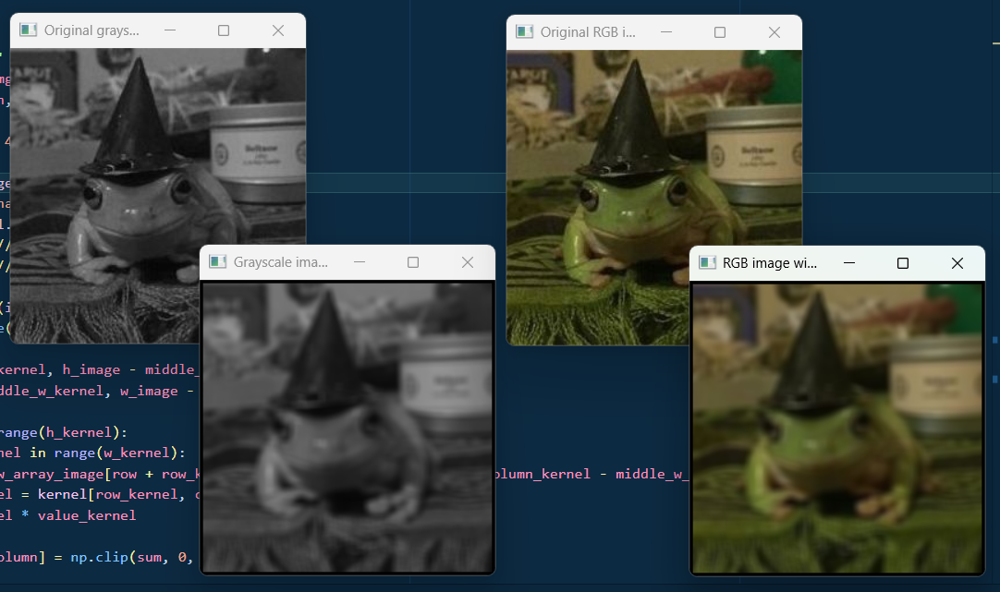
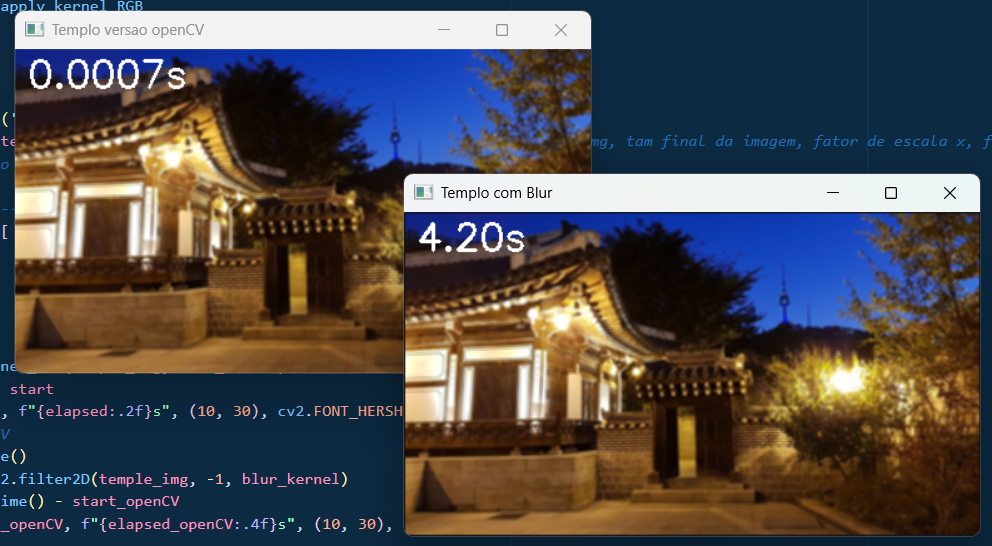
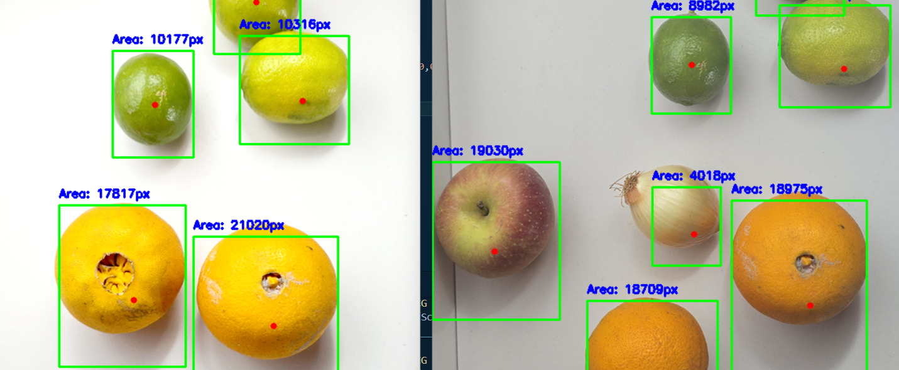

# Ficha técnica

### Pitch
Programa foi desenvolvido em Python, utilizando as bibliotecas Numpy e OpenCV, com objetivo de botar em prática o que aprendemos na disciplina de Computação Gráfica do curso de Ciência da Computação. Duas funções para convolução foram criados, uma para imagens apenas com tons de cinza, e outra para BGR. Apresentamos também, 5 kernels aplicados com nossa solução da convolução e o mesmo com a solução da biblioteca OpenCV, neste foram comparados os tempos de processamento e apresentados na tela. 

Para demonstrar nossos aprendizados de detecção de componentes, nos foi disponibilizado duas imagens, e com elas deveríamos detectar e mostrar Bounding Box, Keypoint e Label. A aplicação foi um sucesso.

### Descrição de Funcionalidades
No arquivo convolucao.py:
- 2 funções de convolução, uma tratando apenas imagens em grayscale, e outra BGR.

No arquivo parte1.py:
- 5 kernels são aplicados a uma imagem através da função de convolução que criamos, e outra do OpenCV. Tempos de processamento são disponibilizados na tela.

No arquivo parte2.py:
- 2 imagens são lidas para detecção de componentes, cada objeto tem seu bounding box, keypoint e label.

### Melhorias futuras
Gostariamos de tornar nossas 2 funções de convolução em uma só, para ela se adaptar a cada imagem passada e retornar resultados esperados. Adição de padding para não fazer a imagem reduzir sua resolução. Otimização do tempo de processamento durante a aplicação do kernel.

Demos nosso máximo para centralizar os objetos na parte de detecção, e creio que com mais prática e estudo das propriedades e parâmetros da biblioteca OpenCV, poderíamos fazer máscaras muito mais eficientes, melhorando o resultado.

### Autores e tecnologias
Código em Python, usando Numpy e OpenCV, feito por Isabela Rodrigues e Lafayete Barth.
## Como rodar o programa

1. Certifique-se de ter o Python 3 instalado.
2. Instale as dependências em um ambiente virtual:

   ```bash
   pip install -r requirements.txt
   ```
3. Execute o script.
- Para testar os métodos de convolução (grayscale e BGR):

   ```bash
   python3 convolucao.py
   ```

- Para a parte 1 (templo e aplicação de 5 kernels):

   ```bash
   python3 parte1.py
   ```

- Para a parte 2 (detecção de objetos, frutas e cebola):

   ```bash
   python3 parte2.py
   ```

